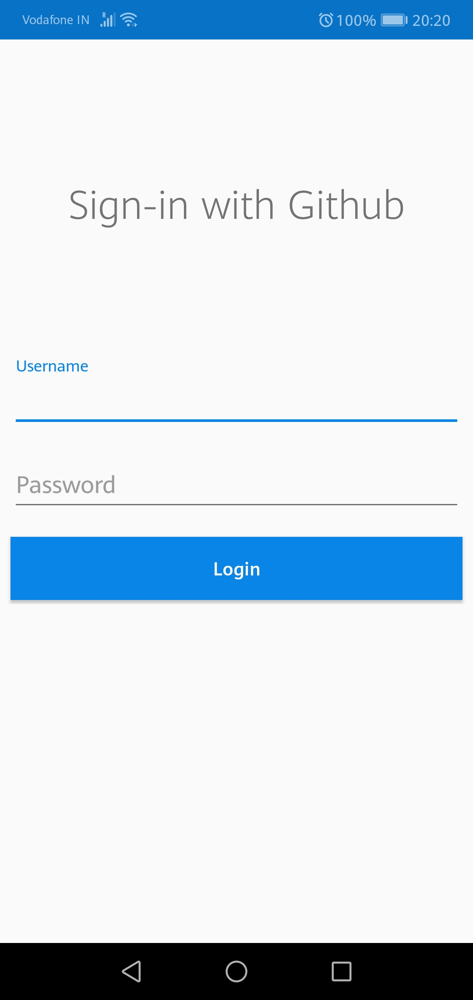
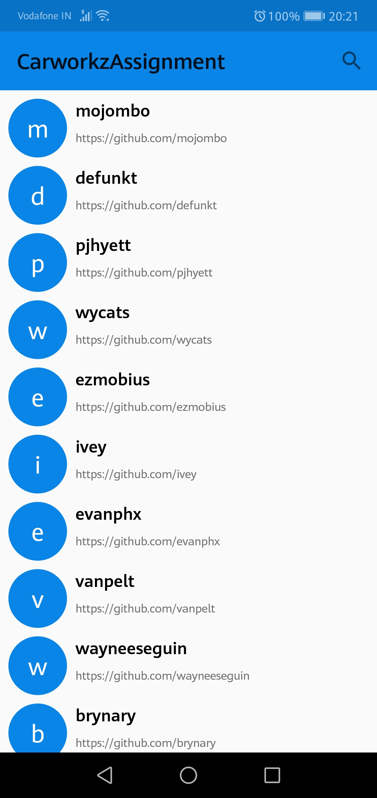
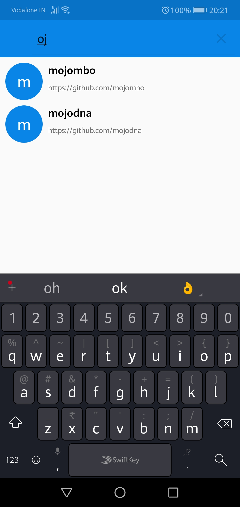

# Carworkz-Android-Offline-Assignment
Its an Android application project which aloows the user to login with their github credentials and see github users list with search functionality.

## Screenshots
   

## How to Run
Clone or download the repo and open in android studio after that you will be able to run it on any device or emulator.

## Application Usage

<ol>
  <li>First time when user runs the application user has to login with their github credentials.</li>
  <li>After that user will be redirected to the Users page where users list is displayed. </li>
  <li>Search option is given on top right of users screen.</li>
  <li>User can search any user by typing the name</li>
</ol>

## Libraries Used
<ul>
  <li>RxJava</li>
  <li>RxAndroid</li>
  <li>Android Fast Networking Library</li>
  <li>Kotlin-Extension-Plugin</li>
</ul>

## Bugs
<ul>
  <li>Some issue is there with the Room persistence library so currently data is not stored locally.</li>
   <li>Less number of uers are being displayed working on github api to get desired user limit.</li>
<ul>
